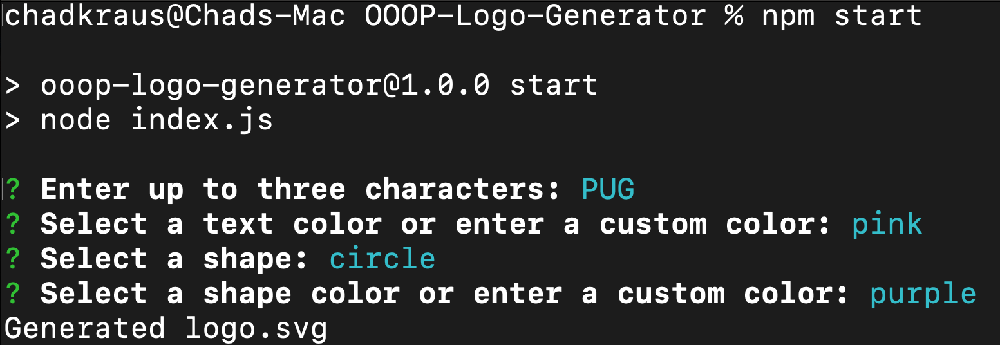
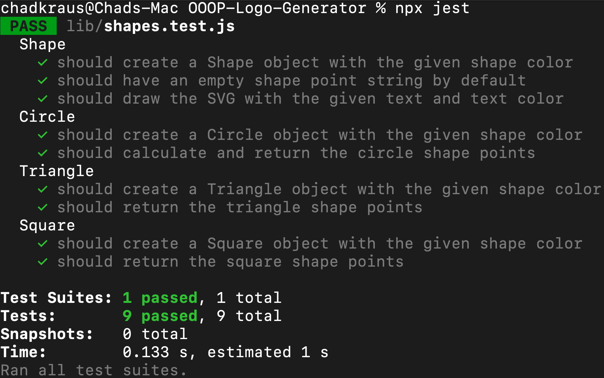

# OOOP-Logo-Generator
An application that allows users to generate custom logos.

## Description

This program is designed to help users create a simple, custom logo for their projects using the command line by answering a series of questions. The user will be asked to enter up to 3 characters, select a text color or enter a custom text color, choose a shape, and finally, the user will be prompted to chooes the color of their logo shape or enter a custom shape color. The user's custom logo will then be generated and saved locally as a .svg file.

[GitHub Repository](https://github.com/chadkraus87/OOOP-Logo-Generator)

## Table of Contents

- [Installation](#installation)
- [Usage](#usage)
- [License](#license)
- [Contributing](#contributing)
- [Tests](#tests)
- [Questions](#questions)

## Installation

The NPM Inquirer.js package is required to run this application. To install the package, please visit [NPM Inquirer.js documentation](https://www.npmjs.com/package/inquirer).

The Jest package is also required. To install the package, please visit [Jest package documentation](https://www.npmjs.com/package/jest).

## Usage

As a busy freelancer looking to launch your project quickly, this application will allow you to create a simple, custom logo while also saving you time. In order to get started, you will need to first install the dependency packages mentioned above in the Installation section by running "npm install". After doing this, you can execute the program to start by using the command "node index.js" and follow the prompts to provide information about your project. The generator will automatically create your customized logo based on your selections and save the file locally. Thank you for using my tool, and happy coding!

## License

This project is licensed under the MIT License license.

## Contributing

[NPM Inquirer Package](https://www.npmjs.com/package/inquirer)

[NPM Jest Package](https://www.npmjs.com/package/jest)

[Node.js](https://nodejs.org/en/docs)

[Getting Started - SVG](https://developer.mozilla.org/en-US/docs/Web/SVG/Tutorial/Getting_Started)

[SVG Basic Shapes](https://developer.mozilla.org/en-US/docs/Web/SVG/Tutorial/Basic_Shapes)

[SVG Polygon](https://www.w3schools.com/graphics/svg_polygon.asp)

[JavaScript Class Extends](https://www.w3schools.com/jsref/jsref_class_extends.asp)

[Video Submission Guide](https://coding-boot-camp.github.io/full-stack/computer-literacy/video-submission-guide)

[Screencastify](https://www.screencastify.com/)

## Tests

N/A

## Questions

If you have any questions or comments about this project, please contact me at chadkraus87@gmail.com. You can also find more information and other projects on my GitHub https://github.com/chadkraus87. If you encounter any issues or bugs while using this tool, please report them to the project GitHub repository so that they can be addressed. Additionally, contributions to this project are always welcome. If you would like to contribute, please review the project contribution guidelines and submit a pull request. Thank you for your support!
